<div align="center">

[Русский](README.md) · [English](README.en.md)

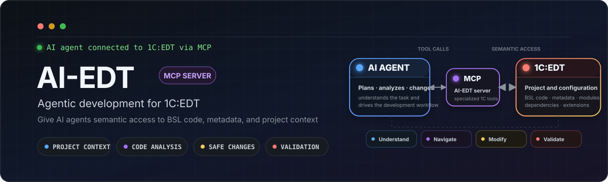

[](https://github.com/Desko77/ai-edt/actions/workflows/build.yml)
[](https://github.com/Desko77/ai-edt/releases/latest)
[](https://desko77.github.io/ai-edt/)

[](#-1-requirements)
[](#-1-requirements)
[](#-how-it-works)
[](LICENSE)

**Give an AI assistant structured access to a 1C project through the services of a live EDT instance.**

[Quick start](#-quick-start) · [Capabilities](#-what-you-can-do) · [Architecture](#-how-it-works) · [Contributing](#-contributing)

</div>

---

AI-EDT is an MCP server implemented as a plugin running **inside a live 1C:EDT instance**. It lets Claude, Cursor, GitHub Copilot and other MCP clients inspect and edit metadata and BSL, navigate semantic references, control the debugger, validate projects and work with a configured infobase.

Instead of treating an EDT workspace as a directory of XML and BSL files, an assistant can use EDT's own semantic model, indexes, validators and debug services.

> [!IMPORTANT]
> The current line runs on **1C:EDT 2026.1.2** and **2026.2.0** and needs **Java 17**. Supported versions are listed by name - the full list, and why earlier ones will not do, is in [Requirements](#-1-requirements). It is built against 2026.1, so one artifact installs on both. The plugin runs wherever EDT runs; only the build and installation scripts documented below assume Windows.

## 🎯 Why AI-EDT

A text-only assistant can search files, but it cannot reliably answer questions that depend on the IDE model:

- Which metadata object does this reference resolve to?
- Which forms, roles and subsystems depend on a catalog?
- What type did EDT infer at this BSL position?
- Why is the project validator rejecting this object?
- What is happening in a suspended 1C debug session?
- Can a metadata change be applied without hand-editing EDT XML?
- Will this query compile against this particular configuration - do those tables and fields exist in it?
- What does EDT's own validator make of the new code, rather than a text linter standing outside it?
- Will this form open for a user, or fall apart when the configuration reaches the infobase?
- Will this composition schema assemble into a report that works, rather than one that merely exists as a file?

AI-EDT exposes those operations as purpose-built MCP tools - the same services the IDE itself runs on. The assistant does not only write BSL, a query, a form, a composition schema or a metadata object: it checks the result against EDT's validators straight away, so a mistake surfaces on the spot instead of the first time an infobase loads the configuration. Less guessing, fewer brittle text edits, and the whole job stays inside the model the developer sees in the IDE.

## ⚡ What you can do

| Workflow | What the assistant can do |
|---|---|
| 🔍 **Explore code and metadata** | Search BSL, resolve symbols, find semantic references, inspect call hierarchies, list modules and read object structure. |
| 🏗️ **Create and edit metadata** | Build catalogs, documents, registers, forms, roles, commands, services and other objects through `edit_metadata`, with preview and batch operations. |
| 🐞 **Debug BSL** | Start or attach a debug session, set line and exception breakpoints, inspect variables, evaluate expressions, step and collect profiling data. |
| 🩺 **Diagnose a configuration** | Read EDT problems, revalidate objects, inspect dependency graphs, detect query anti-patterns and estimate change impact. |
| 🧱 **Build complex artifacts** | Work with DCS, MXL, XDTO, extensions, external objects and external data sources through dedicated workshops. |
| 🧪 **Test and inspect data** | Run or debug YAxUnit tests, execute Vanessa Automation scenarios and inspect runtime state through a suspended debug session. |
| 🛡️ **Review security boundaries** | Audit roles and RLS, scan source and metadata for potentially sensitive data, and disable write-capable tools with presets. |

The server exposes more than one hundred operations. Related actions are grouped behind facades such as `code_search`, `edit_metadata`, `launch_debugger`, `diagnostics`, `insights` and `security_audit`, so an MCP client sees a compact tool surface instead of a long list of near-duplicates.

### 🧮 Metadata, queries and forms - where a text-only assistant breaks most often

**Metadata is created from a description, not by editing XML.** Telling the assistant what you need is enough: a catalog with these attributes, a document with these register records, a list form for it. The assistant turns that into a plan of `edit_metadata` operations and runs it as one batch instead of a dozen scattered calls. Any step can be run with `dryRun=true` first and reports exactly what it would touch; deletions and other destructive operations take a separate confirmation. Changes go through the EDT model rather than through the text of an `.mdo`, and the objects are revalidated right after they are applied, so a mistake shows up on the spot instead of when an infobase first loads the configuration.

**A query is checked before anyone runs it.** `validate_query` parses the text in the context of the project and returns syntax and semantic errors with line numbers, with a separate mode for DCS queries. Alongside them comes a list of hints for the usual slips: SQL keywords instead of the 1C query language, `УБЫВАНИЕ` where `УБЫВ` belongs. The assistant does not have to start the configuration to find out that a query will not compile.

**And what that query returns, too.** With `describeResult=true` the same tool reports the columns of each result and their types, taken from EDT's query-wizard model rather than read off the text. A package is worked through whole: temporary tables are not passed off as results, but they keep their position in `ВыполнитьПакет()`, so the indexes match the real ones. A type that cannot be determined is left out entirely - a confident wrong answer would cost more than an honest gap. The assistant stops guessing column names, and a whole class of errors that otherwise survives until run time goes with them.

**A form is built by the EDT generator, not by the assistant.** Describing the form you need is enough: `create_form` takes a purpose - object form, list form, choice form, Russian synonyms accepted - and the form is produced by the same generator the IDE wizard uses, with a main attribute and a working layout. From there it is refined piece by piece: attributes and columns, fields, dynamic list tables, commands, event handlers, parameters, the command interface, functional options. The result is read back through `get_form_structure` and looked at through `get_form_screenshot`, while `validate_for_export` catches the form defects that pass EDT validation and only surface when the infobase loads the configuration.

## 🔄 A typical agent loop

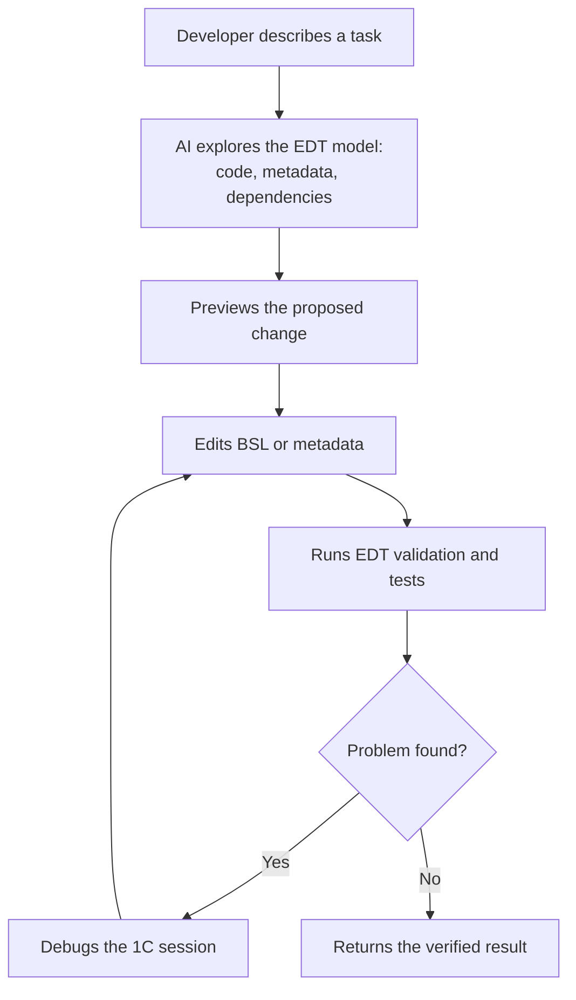

## 🧩 How it works

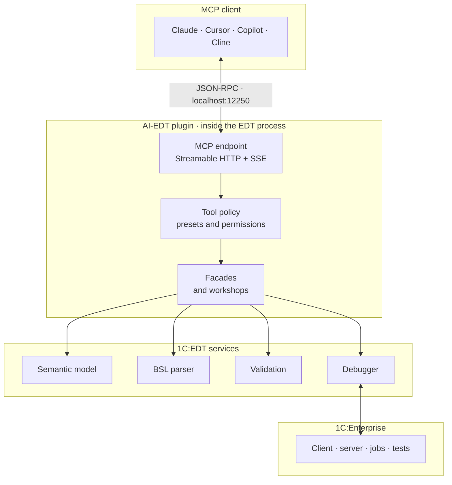

The endpoint defaults to `http://localhost:12250/mcp`. The plugin is not a standalone headless server: EDT must be running and the target project must be loaded. This is what gives tools access to resolved references, inferred types, current validation markers and live debug state.

## 🚀 Quick start

### 📋 1. Requirements

- 1C:EDT - specific versions, see the list below
- Java / JDK **17**
- Maven **3.9+** to build from source
- Any OS that runs 1C:EDT. The plugin is built and fully tested on Linux in CI. Windows is needed only by the helper scripts `build.cmd` and `scripts/edt-selfupdate.ps1`, and the install commands below are written for PowerShell; installing through the p2 director itself is OS-independent

#### Supported 1C:EDT versions

- **2026.1.2**
- **2026.2.0**

The versions are named one by one; the list has no floor. "2026.1 and newer" would promise something
about releases that do not exist yet, and about earlier builds of the same line that nobody has checked.
A version joins the list once compatibility has been provided and verified: listed means checked.
Anything absent from the list counts as unsupported, even if it is formally newer than what is there.

Earlier builds of the 2026.1 line, 2026.1.0 among them, have not been checked. The plugin needs
`dt.metadata.common` 4.0, `dt.metadata.mdclass` 12.0 and `dt.metadata.mdclass.util` 6.0, and in the
current 2026.1 those packages are at exactly those versions - there is no margin, so an earlier build of
the line may not do.

On 2025.2 and earlier the plugin will not install. The same three packages are below what it needs
(`dt.metadata.common` 3.14, `dt.metadata.mdclass` 11.0, `dt.metadata.mdclass.util` 5.18), and 2025.1
additionally has no `dt.platform.services.core.infobases.sync.v2`. The p2 installer reports this as
"Missing requirement".

Optional features require YAxUnit, Vanessa Automation or an Attach debug configuration; see [Optional integrations](#-optional-integrations).

### 🔨 2. Build

From the repository root:

```cmd
build.cmd [EDT_INSTALL_DIR]
```

Alternatively, build the Maven reactor directly:

```cmd
cd mcp
mvn clean verify
```

The generated P2 repository is:

```text
mcp/repositories/ru.aiedt.mcp.server.repository/target/repository
```

### 📦 3. Install into EDT

#### 🤖 Just ask your agent to install the plugin

**Installation comes down to one message to an agent: it installs the plugin itself, without a single click.** You need an AI agent with shell access on the machine where EDT is installed.

Hand it this prompt:

```text
Install the AI-EDT plugin into my 1C:EDT.

Recipe: https://github.com/Desko77/ai-edt/blob/main/docs/agent-install.md
Read it in full and follow it.

Install from the update site https://desko77.github.io/ai-edt/ using the Equinox p2
director (1cedtc.exe in the EDT installation directory). Do not use the
"Install New Software" wizard.
This is a first installation, so do not pass -uninstallIU.

Before installing, close the running EDT session and record its command line;
afterwards relaunch it with the same arguments and wait for the health endpoint
to answer status: ok.

Then install the skill from the repository's skills/ai-edt folder for yourself -
without it you drive the server blind. The procedure is in skills/README.md.

Never force-kill anything. If EDT will not close on its own, stop and tell me.
```

If the plugin is already installed and you are updating it, replace the first-installation sentence with: `The plugin is already installed, update it in a single director request with -uninstallIU and -installIU.`

The full recipe, including the rules the agent has to respect around a running IDE, is in [docs/agent-install.md](docs/agent-install.md).

#### 🖱️ Through the EDT user interface

Both manual routes - the wizard and the command line - install the same feature from the same update site, so building the plugin yourself is optional:

```text
https://desko77.github.io/ai-edt/
```

EDT takes that address the same way it takes a local archive.

**Step 1.** Start EDT and open **Help → Install New Software**.

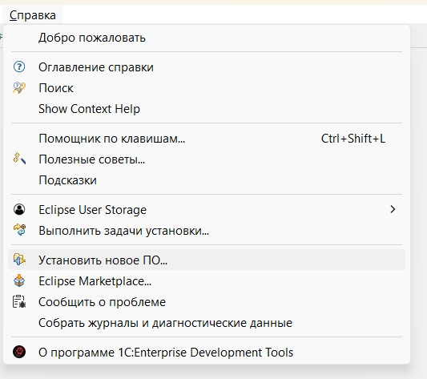

**Step 2.** Press **Add** next to the **Work with** field.

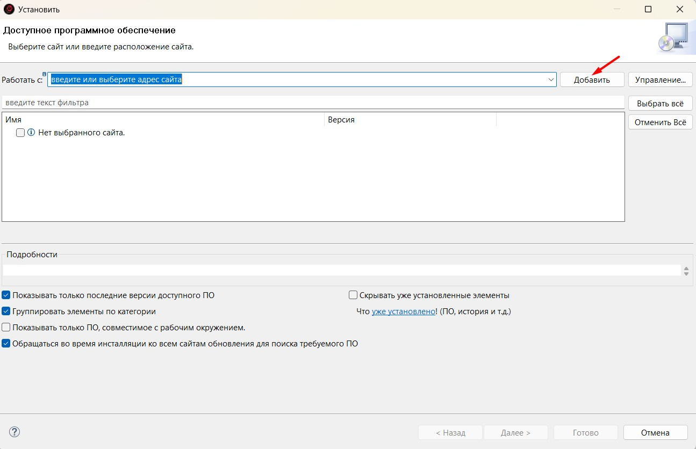

**Step 3.** In the **Add Repository** dialog tell EDT where to take the plugin from. Any of these works:

- the **Location** field and the update site `https://desko77.github.io/ai-edt/`;
- the same field and an address pointing straight into the latest release archive - p2 can read a repository inside a zip over HTTP:

  ```text
  jar:https://github.com/Desko77/ai-edt/releases/latest/download/AI-EDT-update-site.zip!/
  ```

  This one always resolves to the newest release and does not depend on the site being published, so it cannot fall behind. Mind the `jar:` prefix and the trailing `!/` - the address does not work without them.
- **Archive** and the file `mcp/repositories/ru.aiedt.mcp.server.repository/target/AI-EDT-<version>.zip` from a local build;
- **Local** and the folder `mcp/repositories/ru.aiedt.mcp.server.repository/target/repository`.

The repository name is arbitrary, for example `AI-EDT`.

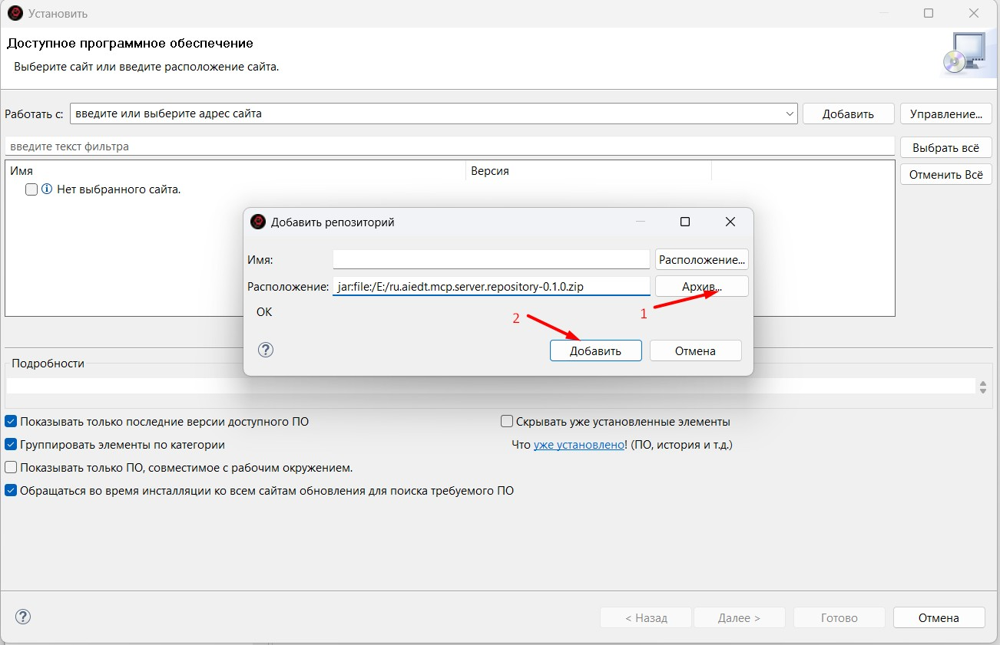

**Step 4.** Select the **AI-EDT** category or the **AI-EDT (1C AI tools for EDT)** feature inside it, then press **Next**. If the list appears empty, clear **Group items by category**.

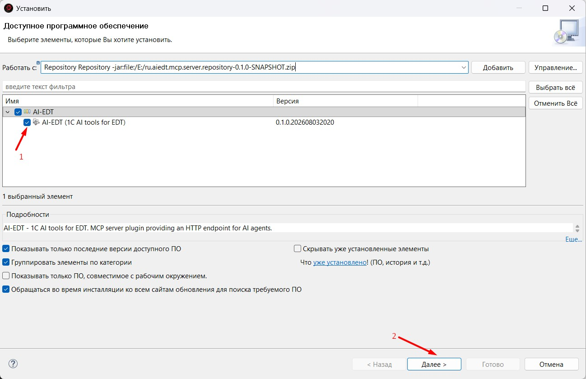

**Step 5.** Review the install details, accept the license agreement and press **Finish**.

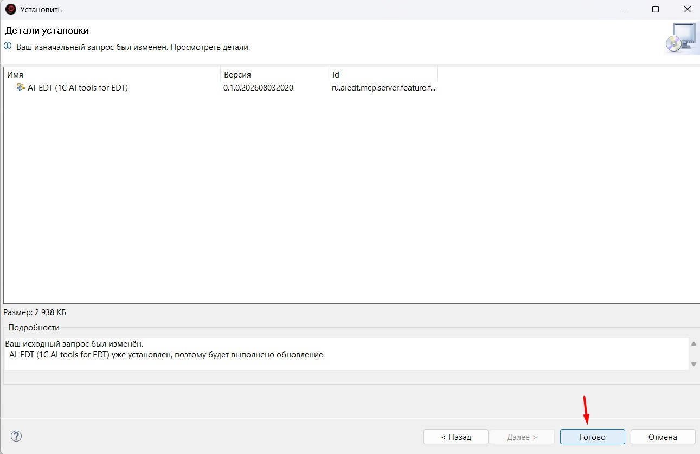

**Step 6.** The build is not signed, so on a first installation EDT asks for confirmation before installing unsigned content. Accept it to continue.

**Step 7.** Agree to restart EDT when the installer offers to.

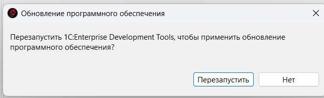

After the restart, continue with **4. Start and verify** below.

#### ⌨️ From the command line

The Equinox P2 director installs the same feature with no UI. Close the EDT session you are updating first: a running instance keeps the old plugin in memory until it restarts, so the restart is needed anyway, and a session that is itself running a provisioning operation holds the profile lock.

```powershell
& "<EDT>\1cedtc.exe" -nosplash `
  -application org.eclipse.equinox.p2.director `
  -repository "file:///C:/path/to/AI-EDT/mcp/repositories/ru.aiedt.mcp.server.repository/target/repository" `
  -uninstallIU ru.aiedt.mcp.server.feature.feature.group `
  -installIU ru.aiedt.mcp.server.feature.feature.group `
  -profileProperties org.eclipse.update.reconcile=true
```

The feature is a p2 singleton, so installing a new version over an existing one fails unless the old unit is removed in the same request. On a first installation drop the `-uninstallIU` line - there is nothing to remove yet.

For a development session, `scripts/edt-selfupdate.ps1` performs the whole cycle: graceful close, install, relaunch and health check.

#### 🎓 Install the skill while you are at it

Whichever route you took, installing the plugin is not the end of it. The plugin gives the agent the
tools; it does not say how to use them - which facade fits a job, which checks are mandatory after an
edit, what a response carrying a resume key means. That knowledge lives in the `skills/ai-edt` folder
and installs by copying it:

```powershell
Copy-Item -Recurse skills\ai-edt "$env:USERPROFILE\.claude\skills\ai-edt"
```

```bash
cp -r skills/ai-edt ~/.claude/skills/ai-edt
```

That is the per-user location for Claude Code; `.claude/skills/ai-edt` inside a project scopes the
skill to that project. If you installed from the update site and have no checkout at hand, take the
folder from a shallow clone:

```powershell
git clone --depth 1 https://github.com/Desko77/ai-edt.git "$env:TEMP\ai-edt-skill"
Copy-Item -Recurse "$env:TEMP\ai-edt-skill\skills\ai-edt" "$env:USERPROFILE\.claude\skills\ai-edt"
Remove-Item -Recurse -Force "$env:TEMP\ai-edt-skill"
```

Another agent follows its own convention: `SKILL.md` is plain Markdown with a name and a description
in the front matter, and the files under `references/` load on demand. Details in
[skills/README.md](skills/README.md).

The skill is optional. Without it an agent still works, just the expensive way - whole modules read,
files EDT owns edited by hand, a call retried that had already handed back a resume key.

### ▶️ 4. Start and verify

Open **Window → Preferences → AI-EDT** and check:

1. the server port, normally `12250`;
2. click **Start** to run the server now, or enable **Auto-start** and restart EDT;
3. **Plain text mode** for clients that do not support MCP resources;
4. the active tool preset.

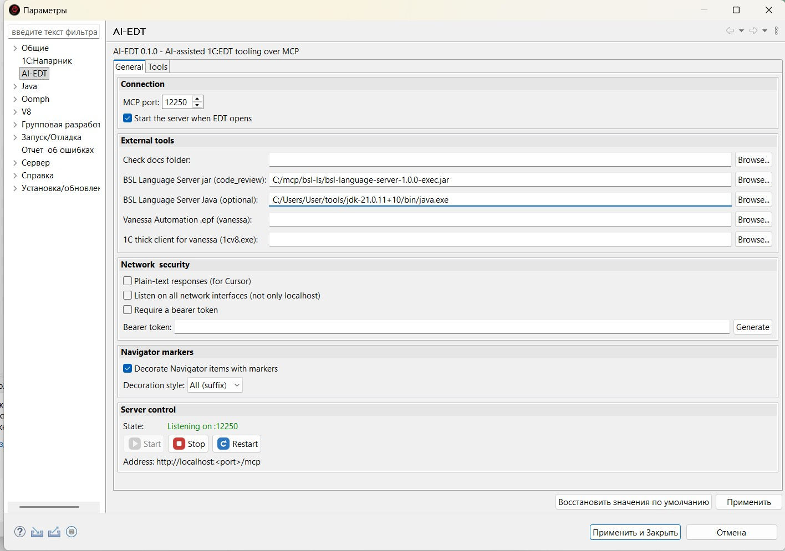

Then check the health endpoint:

```powershell
curl.exe http://localhost:12250/health
```

A ready instance returns a response with `status: ok` and `phase: ready`. If the phase is `indexing`, wait until EDT finishes loading the project.

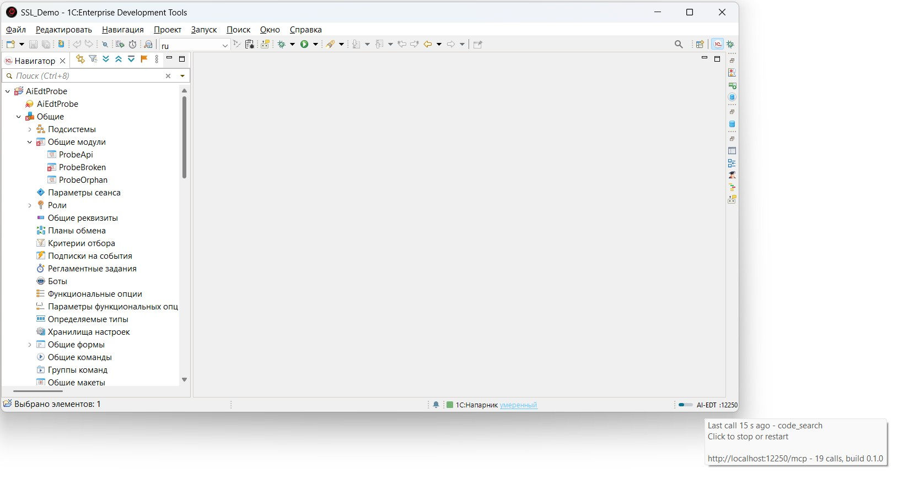

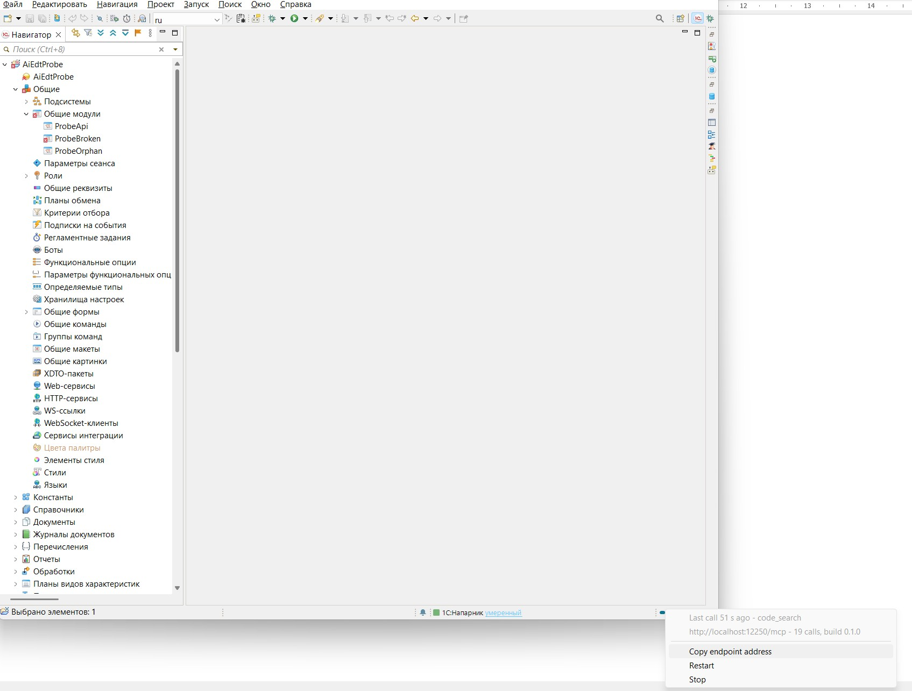

### 🔗 5. Connect an AI client

#### Claude Code

Add the server to `%USERPROFILE%\.claude.json`:

```json
{
  "mcpServers": {
    "AI-EDT": {
      "type": "http",
      "url": "http://localhost:12250/mcp"
    }
  }
}
```

#### Cursor

Create `.cursor/mcp.json` in the project root and enable **Plain text mode** in AI-EDT preferences:

```json
{
  "mcpServers": {
    "AI-EDT": {
      "url": "http://localhost:12250/mcp"
    }
  }
}
```

#### VS Code / GitHub Copilot

Create `.vscode/mcp.json`:

```json
{
  "servers": {
    "AI-EDT": {
      "type": "http",
      "url": "http://localhost:12250/mcp"
    }
  }
}
```

Configurations for Claude Desktop, Cline and Antigravity are available in [docs/clients.md](docs/clients.md).

### 🎓 5a. Check the skill is in place

The **[skills/ai-edt](skills/ai-edt)** skill installs back at the install step, under
[Install the skill while you are at it](#-install-the-skill-while-you-are-at-it). If you skipped it,
now is the moment: the client is connected and the difference shows on the first task. In Claude
Code the skill appears in the available list as `ai-edt`.

### 💬 6. Make the first call

Ask the client to list EDT projects or report the EDT version. A successful response should contain structured project information, not “tool unavailable”.

Example prompts:

```text
List the EDT projects in the current workspace and summarize their validation state.
```

```text
Find all semantic references to Catalog.Products and group them by metadata, forms and BSL modules.
```

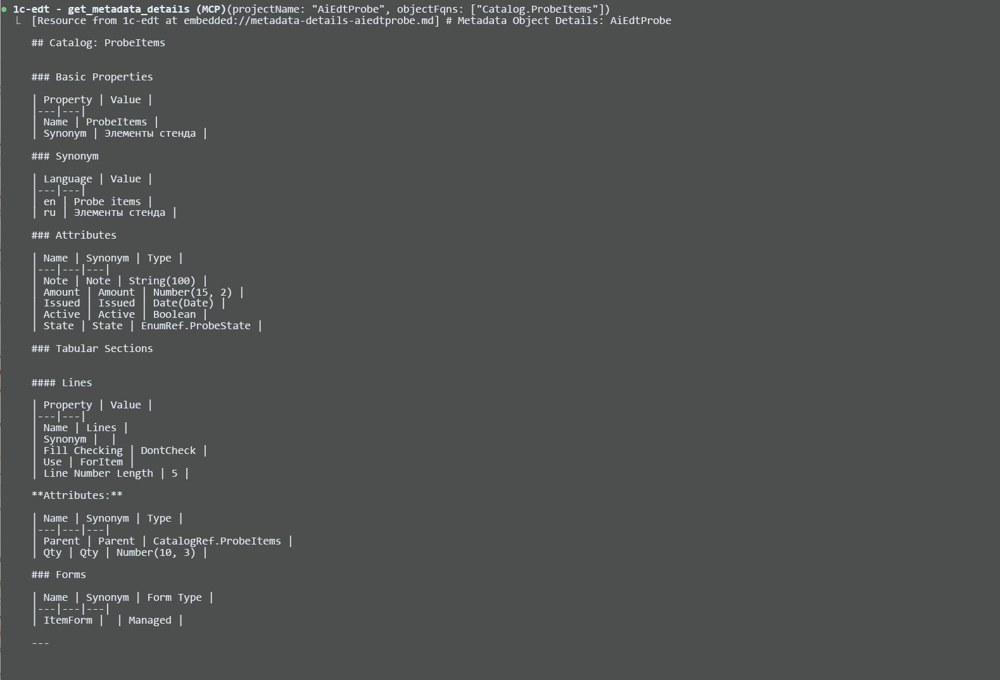

## 🧰 Tool surface

AI-EDT uses a facade-first API. A facade accepts an operation discriminator and routes related actions through one stable entry point.

| Facade | Scope |
|---|---|
| `code_search` | Text search, references, symbol resolution, call hierarchy, symbol information and content assist. |
| `edit_metadata` | Metadata, forms, commands, roles, services, templates and other model mutations. |
| `launch_debugger` | Launch/attach, breakpoints, stepping, variables, expression evaluation and profiling. |
| `diagnostics` | Project problems, check documentation, cleanup and targeted revalidation. |
| `insights` | Dependencies, metrics, anti-patterns, comparison and impact analysis. |
| `security_audit` | Role rights, RLS violations and sensitive-data scanning. |
| `project_admin` / `infobase_admin` | Workspace projects, launch configurations, database updates and synchronization. |
| `dcs_workshop` / `mxl_workshop` / `xdto_workshop` | Programmatic builders for complex 1C artifacts. |
| `extension_workshop` / `external_object_workshop` | Extension and external report/data-processor lifecycle operations. |
| `yaxunit_tests` | Run or debug selected YAxUnit tests and read their reports. |

Legacy standalone tool names remain callable as compatibility aliases. The **Canonical** preset hides those aliases from `tools/list`, reducing context use without removing capabilities.

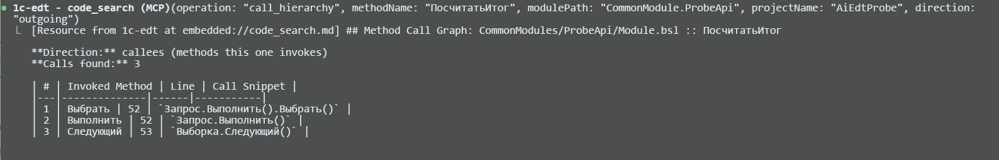

## 🔐 Tool presets and safety

The **Tools** preference page groups tools by capability and supports these presets:

| Preset | Intended use |
|---|---|
| **Canonical** | Recommended default. Facades are listed; compatibility aliases remain callable but hidden. |
| **All Tools** | Lists every registered tool and alias. Useful for API exploration. |
| **Read-only** | Search, navigation and validation without edits, debugging or database updates. |
| **Editing** | Read and write access without debugging. |
| **Debug & Test** | Read, debug and test access without source or metadata mutation. |
| **Code Review** | Focused source and metadata analysis with no writes. |

Each tool can be **listed**, **callable-hidden** or **disabled**. Hidden tools still accept calls; disabled tools are rejected. This distinction lets the Canonical preset reduce catalog noise while restrictive presets enforce an actual boundary.

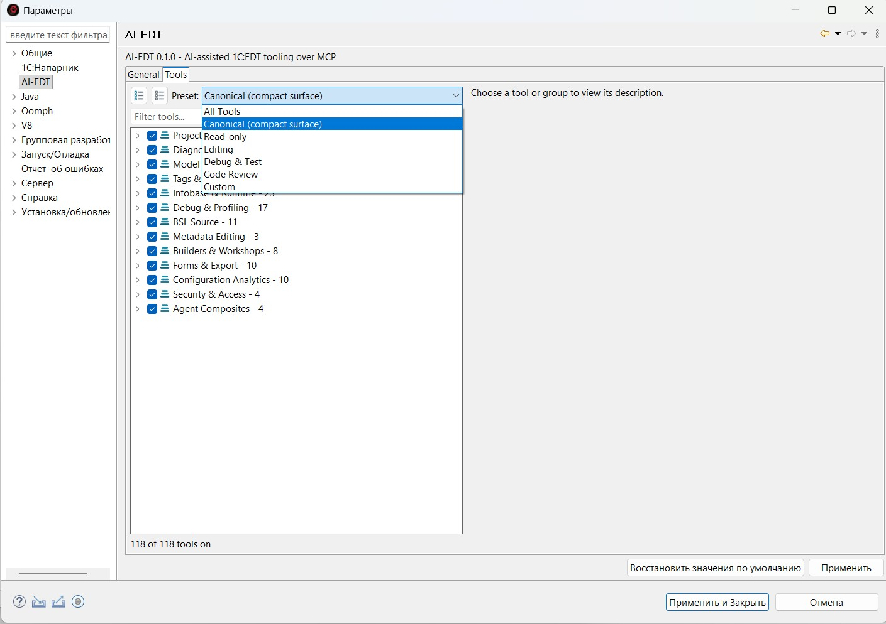

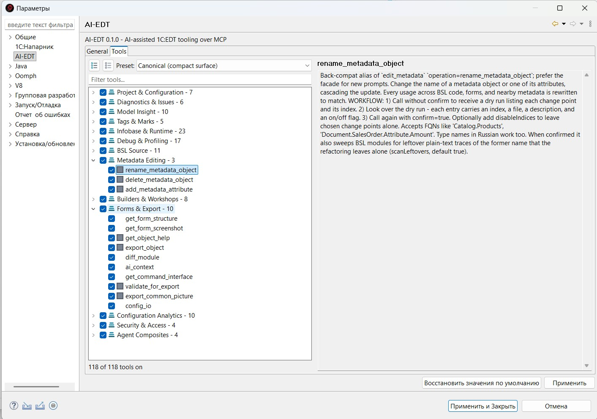

> [!CAUTION]
> The plugin runs with the permissions of the EDT process. It can modify source, metadata and infobases. Keep the project in version control, review previews before confirming destructive operations, and do not expose the unauthenticated local port beyond loopback.

### Access token and interface binding

By default the server listens on `127.0.0.1` only and asks for no authentication: nothing leaves the
machine. To open the endpoint up, **Preferences → AI-EDT** carries two settings, and they belong
together:

- **Bearer token.** A button generates a random token; the client sends it as
  `Authorization: Bearer <token>`. The comparison runs in constant time, so the token cannot be
  guessed from response timings. A request without the right token is rejected before it reaches a
  tool.
- **Bind to every interface.** Lifts the loopback restriction. Turned on without a token, the plugin
  writes a warning to the log: any host that can reach this machine can then read and change the
  sources and the infobase.

### Personal-data masking

A separate setting masks personal data on its way out of a tool, by the categories Russian federal
law 152-FZ names: taxpayer number, insurance number, payment card, passport, phone, email. Off by
default.

What it honestly is and is not:

- It is built for precision over recall. Taxpayer, insurance and card numbers are checksum-validated,
  and passport and phone require a separator, so an arbitrary numeric identifier is not mangled. The
  other side of that: it does not catch names, addresses or other personal data in free text.
- It masks a tool's own output and error text, not the JSON-RPC envelope and not image blobs: the
  shape of the response never changes, only the content of strings.
- It lowers the risk of a leak into a cloud model. It does not replace deciding what an assistant
  should be shown in the first place.

### Other measures

- Metadata refactoring tools provide preview/confirm workflows.
- Read-only mode is the preferred preset for unfamiliar projects.
- `evaluate_expression` executes code against a live 1C session.
- Database deletion, configuration import and synchronization can be disabled independently.
- Back up an infobase before structural updates that cannot be reverted from Git.

## 🐞 Debugging client and server code

The debugger facade supports ordinary client launches and **Attach to 1C:Enterprise Debug Server** configurations. Attach is required for HTTP services, server calls, background jobs, scheduled jobs and code running in `rphost`.

The agent discovers an EDT launch configuration, attaches to the 1C debug server, sets a breakpoint and waits for a suspend event. AI-EDT then returns stable references to the thread, stack and frame so the agent can inspect variables, evaluate expressions, step through the code and resume execution.

## 🔌 Optional integrations

| Integration | What it enables | Required setup |
|---|---|---|
| **YAxUnit** | Run and debug unit tests, filter suites and parse JUnit reports. | Install the YAxUnit extension in the target infobase. |
| **Vanessa Automation** | Execute scenario-based UI tests. | Configure Vanessa separately and create the required launch setup. |
| **1C debug server** | Debug server-side BSL through Attach. | Start `ragent` with `-debug -http` and create an EDT Attach configuration. |
| **BSL Language Server** | Additional source review through `code_review`. | Configure the external JAR in AI-EDT preferences. |

## ⚠️ Limitations

- AI-EDT depends on internal and public EDT services; a major EDT update may require a plugin update.
- The server is available only while EDT is running.
- Some semantic tools require project indexing to be complete.
- By default the endpoint listens on loopback and asks for no authentication. A bearer token and a bind-to-every-interface setting exist, but turning them on is a deliberate act - see the safety section.
- The update site is published automatically on release. Builds made between releases install from source or from a local P2 repository.

## 🤝 Contributing

Contributions are welcome in the form of reproducible bug reports, focused feature proposals, documentation improvements and pull requests.

Start with:

- [CONTRIBUTING.md](CONTRIBUTING.md) - build process, code style and contribution rules (currently in Russian);
- [SECURITY.md](SECURITY.md) - private vulnerability reporting and the threat model (currently in Russian);
- [docs/PROVENANCE.md](docs/PROVENANCE.md) - source provenance and reimplementation history.

Repository layout:

```text
mcp/
├── bundles/       # OSGi plugin implementation
├── features/      # installable Eclipse feature
├── repositories/  # generated P2 repository
├── targets/       # EDT target platform
└── tests/         # plugin and contract tests

docs/              # guides, audits and release notes
scripts/           # development and update automation
```

Before opening a pull request, build the reactor and describe how the change was verified against a running EDT instance.

## 📜 Project origin

AI-EDT is an independent product that originated from [EDT-MCP](https://github.com/DitriXNew/EDT-MCP) by DitriX. The project is distributed under AGPL-3.0-or-later; retained notices and the detailed source history are documented in [LICENSE](LICENSE) and [docs/PROVENANCE.md](docs/PROVENANCE.md).

## ⚖️ License

GNU Affero General Public License v3.0 or later. See [LICENSE](LICENSE).
