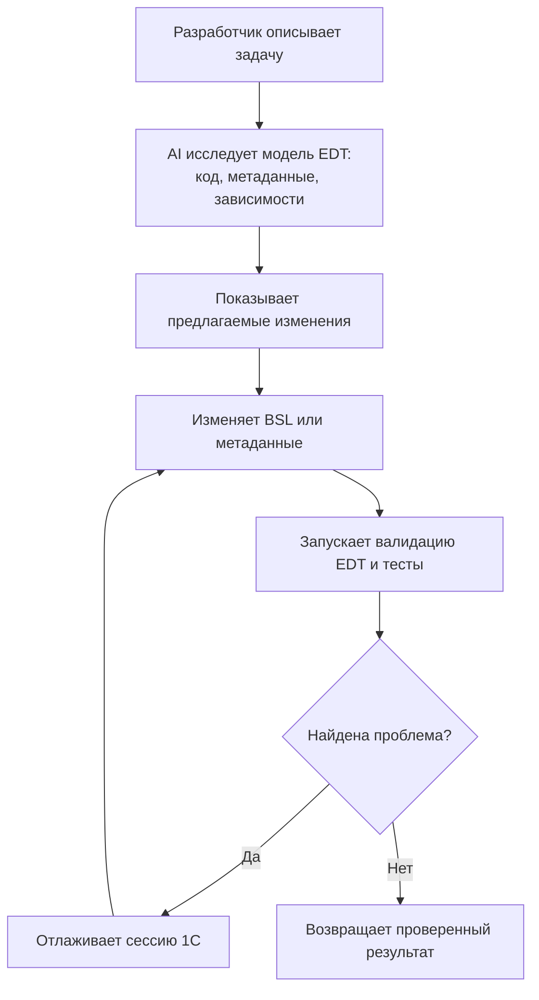
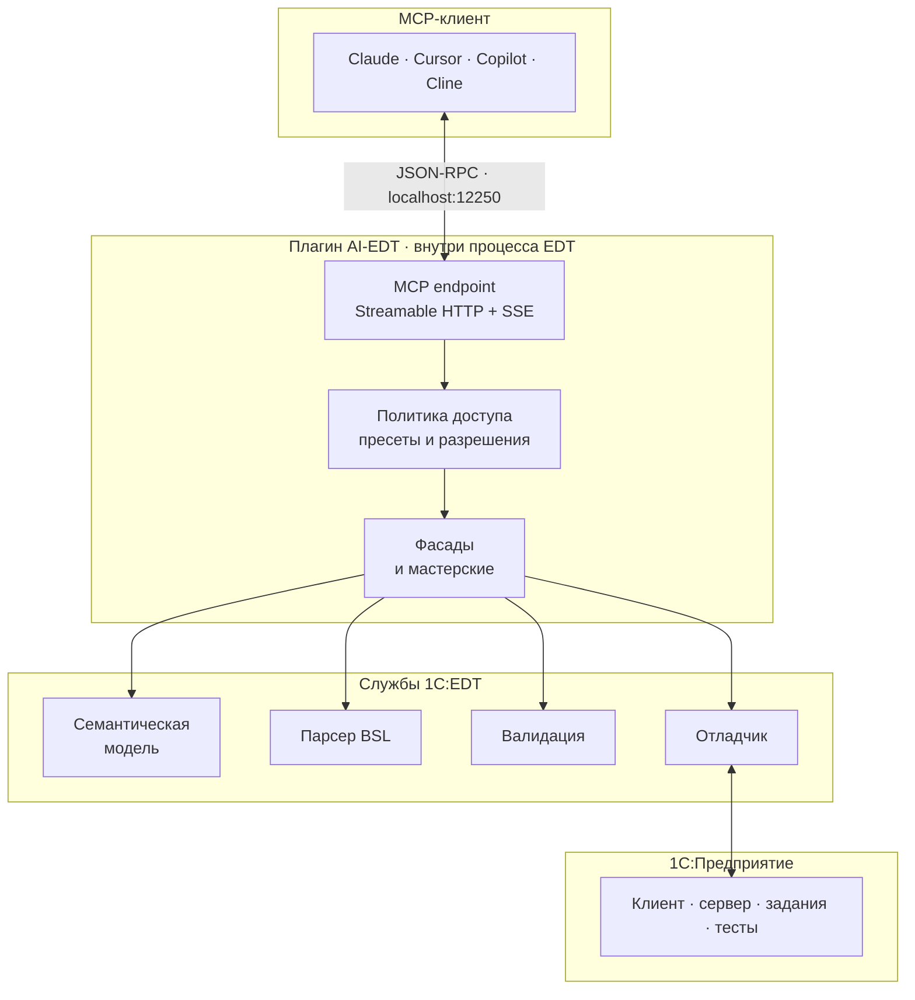

<div align="center">

[Русский](README.md) · [English](README.en.md)


[](https://github.com/Desko77/ai-edt/actions/workflows/build.yml)
[](https://github.com/Desko77/ai-edt/releases/latest)
[](https://desko77.github.io/ai-edt/)

[](#-1-требования)
[](#-1-требования)
[](#-как-это-работает)
[](LICENSE)

**Дайте AI-ассистенту структурированный доступ к проекту 1С через службы запущенного экземпляра EDT.**

[Быстрый старт](#-быстрый-старт) · [Возможности](#-что-можно-делать) · [Архитектура](#-как-это-работает) · [Участие в разработке](#-участие-в-разработке)

</div>

---

AI-EDT - MCP-сервер в виде плагина, работающего **внутри запущенного экземпляра 1C:EDT**. Он позволяет Claude, Cursor, GitHub Copilot и другим MCP-клиентам исследовать и изменять метаданные и BSL, переходить по семантическим ссылкам, управлять отладчиком, проверять проекты и работать с подключенной информационной базой.

Вместо того чтобы воспринимать рабочее пространство EDT как каталог XML- и BSL-файлов, ассистент использует семантическую модель, индексы, валидаторы и службы отладки самой EDT.

> [!IMPORTANT]
> Текущая версия рассчитана на **1C:EDT 2026.1+**, **Java 17** и Windows.

## 🎯 Зачем нужен AI-EDT

Ассистент с доступом только к тексту может искать по файлам, но не способен надежно отвечать на вопросы, зависящие от модели IDE:

- На какой объект метаданных указывает эта ссылка?
- Какие формы, роли и подсистемы зависят от справочника?
- Какой тип EDT вывела в этой позиции BSL?
- Почему валидатор проекта отклоняет объект?
- Что происходит в приостановленной отладочной сессии 1С?
- Можно ли применить изменение метаданных без ручного редактирования XML EDT?

AI-EDT предоставляет для этого специализированные MCP-инструменты. В результате ассистент меньше гадает, реже делает хрупкие текстовые правки и работает с той же моделью, которую использует EDT.

## ⚡ Что можно делать

| Сценарий | Что может сделать ассистент |
|---|---|
| 🔍 **Исследовать код и метаданные** | Искать по BSL, разрешать символы, находить семантические ссылки, строить иерархии вызовов, получать список модулей и структуру объектов. |
| 🏗️ **Создавать и изменять метаданные** | Создавать справочники, документы, регистры, формы, роли, команды, сервисы и другие объекты через `edit_metadata`, включая предпросмотр и пакетные операции. |
| 🐞 **Отлаживать BSL** | Запускать или подключать отладочную сессию, ставить обычные и exception breakpoints, смотреть переменные, вычислять выражения, выполнять шаги и собирать профилирование. |
| 🩺 **Диагностировать конфигурацию** | Получать проблемы EDT, перевалидировать объекты, исследовать граф зависимостей, находить антипаттерны запросов и оценивать влияние изменений. |
| 🧱 **Собирать сложные артефакты** | Работать со СКД, MXL, XDTO, расширениями, внешними объектами и внешними источниками данных через специализированные мастерские. |
| 🧪 **Тестировать и исследовать данные** | Запускать и отлаживать тесты YAxUnit, выполнять сценарии Vanessa Automation и исследовать состояние исполнения в приостановленной сессии отладки. |
| 🛡️ **Проверять границы доступа** | Аудировать роли и RLS, искать потенциально чувствительные данные в коде и метаданных, отключать записывающие инструменты пресетами. |

Сервер предоставляет более ста операций. Родственные действия объединены фасадами `code_search`, `edit_metadata`, `launch_debugger`, `diagnostics`, `insights` и `security_audit`, поэтому MCP-клиент видит компактный набор инструментов вместо длинного списка почти одинаковых команд.

### 🧮 Метаданные, запросы и формы - там, где текстовый ассистент ломается чаще всего

**Метаданные создаются по описанию, а не правкой XML.** Разработчику достаточно сказать, что нужно: справочник с такими-то реквизитами, документ с движениями, форма списка к нему. Ассистент раскладывает это в план операций `edit_metadata` и выполняет его одним пакетом, а не десятком разрозненных вызовов. Любой шаг заранее прогоняется с `dryRun=true` и показывает, что именно будет затронуто; удаление и прочие деструктивные операции требуют отдельного подтверждения. Изменения идут через модель EDT, а не текстом по `.mdo`, и сразу после применения объекты перевалидируются, так что ошибка видна на месте, а не при первой загрузке в информационную базу.

**Запрос проверяется до того, как его кто-то запустит.** `validate_query` разбирает текст в контексте проекта и возвращает синтаксические и семантические ошибки с номерами строк, отдельно для обычных запросов и для запросов СКД. Вместе с ними приходит список подсказок на типовые промахи: слова SQL вместо языка запросов 1С, `УБЫВАНИЕ` вместо `УБЫВ`. Ассистенту не нужно запускать конфигурацию, чтобы выяснить, что запрос не соберется.

**Форму собирает генератор EDT, а не ассистент.** Достаточно описать, какая форма нужна: `create_form` принимает назначение - форма объекта, форма списка, форма выбора, русские синонимы тоже принимаются, - и форму строит тот же генератор, которым пользуется мастер IDE, с основным реквизитом и рабочей раскладкой. Дальше она правится по частям: реквизиты и колонки, поля, таблицы динамических списков, команды, обработчики событий, параметры, командный интерфейс, функциональные опции. Результат читается через `get_form_structure` и просматривается глазами через `get_form_screenshot`, а `validate_for_export` ловит дефекты формы, которые проходят валидацию EDT и проявляются только при загрузке в информационную базу.

## 🔄 Типичный цикл работы агента



## 🧩 Как это работает



По умолчанию сервер доступен по адресу `http://localhost:12250/mcp`. Плагин не является отдельным headless-сервером: EDT должна быть запущена, а целевой проект - загружен. Благодаря этому инструментам доступны разрешенные ссылки, выведенные типы, текущие маркеры валидации и состояние живой отладки.

## 🚀 Быстрый старт

### 📋 1. Требования

- 1C:EDT **2026.1 или новее**
- Java / JDK **17**
- Maven **3.9+** для сборки из исходников
- MCP-совместимый клиент
- Windows для описанного ниже сценария сборки и установки

Для дополнительных возможностей потребуются YAxUnit, Vanessa Automation или конфигурация Attach. Подробнее - в разделе [Дополнительные интеграции](#-дополнительные-интеграции).

### 🔨 2. Сборка

В корне репозитория выполните:

```cmd
build.cmd [EDT_INSTALL_DIR]
```

Альтернативный вариант - собрать Maven-реактор напрямую:

```cmd
cd mcp
mvn clean verify
```

Сгенерированный P2-репозиторий:

```text
mcp/repositories/ru.aiedt.mcp.server.repository/target/repository
```

### 📦 3. Установка в EDT

#### 🤖 Просто попросите агента установить плагин

**Установка сводится к одному сообщению агенту: он поставит плагин сам, без единого щелчка мышью.** Нужен AI-агент с доступом к оболочке на той машине, где стоит EDT.

Скопируйте ему этот промпт:

```text
Установи мне плагин AI-EDT в 1C:EDT.

Рецепт: https://github.com/Desko77/ai-edt/blob/main/docs/agent-install.md
Прочитай его целиком и следуй ему.

Ставь с update site https://desko77.github.io/ai-edt/ через Equinox p2 director
(1cedtc.exe из каталога установки EDT). Мастер "Установить новое ПО" не используй.
Это первая установка, поэтому -uninstallIU не передавай.

Перед установкой закрой запущенный сеанс EDT, запомнив его командную строку;
после установки запусти его теми же аргументами и дождись ответа status: ok
от health endpoint.

Ничего не завершай принудительно. Если EDT не закрывается сам - остановись и скажи мне.
```

Если плагин уже установлен и вы его обновляете, замените предложение про первую установку на: `Плагин уже установлен, обновляй его одним запросом director с -uninstallIU и -installIU.`

Полный рецепт вместе с правилами обращения с запущенной средой - в [docs/agent-install.md](docs/agent-install.md).

#### 🖱️ Через интерфейс EDT

Оба ручных пути - мастер EDT и командная строка - ставят ту же фичу с того же update site, поэтому собирать плагин самостоятельно не обязательно:

```text
https://desko77.github.io/ai-edt/
```

Этот адрес указывается в EDT так же, как локальный архив.

**Шаг 1.** Запустите EDT и откройте **Справка → Установить новое ПО**.


**Шаг 2.** Нажмите **Добавить** рядом с полем **Работать с**.


**Шаг 3.** В диалоге **Добавить репозиторий** укажите, откуда ставить. Подходит любой из вариантов:

- поле **Расположение** и адрес update site `https://desko77.github.io/ai-edt/`;
- **Архив...** и файл `mcp/repositories/ru.aiedt.mcp.server.repository/target/AI-EDT-<версия>.zip` из локальной сборки;
- **Расположение...** и каталог `mcp/repositories/ru.aiedt.mcp.server.repository/target/repository`.

Имя репозитория произвольное, например `AI-EDT`.


**Шаг 4.** Отметьте категорию **AI-EDT** или фичу **AI-EDT (1C AI tools for EDT)** внутри нее и нажмите **Далее**. Если список выглядит пустым, снимите флажок **Группировать элементы по категории**.


**Шаг 5.** Проверьте состав установки, примите лицензионное соглашение и нажмите **Готово**.


**Шаг 6.** Сборка не подписана, поэтому при первой установке EDT просит подтвердить установку неподписанного содержимого. Согласитесь, чтобы продолжить.

**Шаг 7.** Когда установщик предложит перезапустить EDT, нажмите **Перезапустить**.


После перезапуска переходите к разделу **4. Запуск и проверка**.

#### ⌨️ Из командной строки

Equinox P2 director ставит ту же фичу без интерфейса. Сначала закройте обновляемый сеанс EDT: запущенный экземпляр держит старый плагин в памяти до перезапуска, то есть перезапуск все равно понадобится, а сеанс, который сам выполняет операцию установки, удерживает блокировку профиля.

```powershell
& "<EDT>\1cedtc.exe" -nosplash `
  -application org.eclipse.equinox.p2.director `
  -repository "file:///C:/path/to/AI-EDT/mcp/repositories/ru.aiedt.mcp.server.repository/target/repository" `
  -uninstallIU ru.aiedt.mcp.server.feature.feature.group `
  -installIU ru.aiedt.mcp.server.feature.feature.group `
  -profileProperties org.eclipse.update.reconcile=true
```

Фича - это p2-синглтон, поэтому установка новой версии поверх существующей не пройдет, если в том же запросе не удалить старую. При самой первой установке строку `-uninstallIU` нужно убрать: удалять еще нечего.

Для рабочей среды разработки скрипт `scripts/edt-selfupdate.ps1` выполняет весь цикл: аккуратное закрытие, установку, перезапуск и проверку состояния.

### ▶️ 4. Запуск и проверка

Откройте **Window → Preferences → AI-EDT** и проверьте:

1. порт сервера, обычно `12250`;
2. нажмите **Start**, чтобы запустить сервер сейчас, либо включите **Auto-start** и перезапустите EDT;
3. **Plain text mode** для клиентов без поддержки MCP resources;
4. активный пресет инструментов.


После этого проверьте health endpoint:

```powershell
curl.exe http://localhost:12250/health
```

Готовый экземпляр возвращает ответ со значениями `status: ok` и `phase: ready`. Если указано `phase: indexing`, дождитесь завершения загрузки проекта в EDT.


### 🔗 5. Подключение AI-клиента

#### Claude Code

Добавьте сервер в `%USERPROFILE%\.claude.json`:

```json
{
  "mcpServers": {
    "AI-EDT": {
      "type": "http",
      "url": "http://localhost:12250/mcp"
    }
  }
}
```

#### Cursor

Создайте `.cursor/mcp.json` в корне проекта и включите **Plain text mode** в настройках AI-EDT:

```json
{
  "mcpServers": {
    "AI-EDT": {
      "url": "http://localhost:12250/mcp"
    }
  }
}
```

#### VS Code / GitHub Copilot

Создайте `.vscode/mcp.json`:

```json
{
  "servers": {
    "AI-EDT": {
      "type": "http",
      "url": "http://localhost:12250/mcp"
    }
  }
}
```

Конфигурации для Claude Desktop, Cline и Antigravity находятся в [docs/clients.md](docs/clients.md).

### 🎓 5a. Научите агента пользоваться сервером

Подключение дает агенту инструменты, но не объясняет, какой фасад брать под задачу, какие проверки
обязательны после правки и что означает тот или иной ответ. Для этого в составе репозитория есть
скил **[skills/ai-edt](skills/ai-edt)** - скопируйте его в каталог скилов агента, порядок описан в
[skills/README.md](skills/README.md). Он необязателен, но с ним агент работает заметно точнее.

### 💬 6. Первый вызов

Попросите клиента вывести список проектов EDT или версию EDT. Успешный ответ должен содержать структурированную информацию о проекте, а не сообщение "инструмент недоступен".

Примеры запросов:

```text
Покажи проекты EDT в текущем рабочем пространстве и кратко опиши состояние их валидации.
```

```text
Найди все семантические ссылки на Справочник.Номенклатура и сгруппируй их по метаданным, формам и модулям BSL.
```


## 🧰 Набор инструментов

В основе API AI-EDT лежат фасады. Фасад принимает дискриминатор операции и направляет родственные действия через единую стабильную точку входа.

> [!TIP]
> **[Открыть полный каталог инструментов →](docs/tools/README.ru.md)**  
> Все группы инструментов, режимы доступа и раскрываемые описания ключевых фасадов.

| Фасад | Область применения |
|---|---|
| `code_search` | Текстовый поиск, ссылки, разрешение символов, иерархия вызовов, информация о символах и content assist. |
| `edit_metadata` | Изменение метаданных, форм, команд, ролей, сервисов, макетов и других элементов модели. |
| `launch_debugger` | Запуск/подключение, точки останова, шаги, переменные, вычисление выражений и профилирование. |
| `diagnostics` | Проблемы проекта, документация проверок, очистка и точечная перевалидация. |
| `insights` | Зависимости, метрики, антипаттерны, сравнение и анализ влияния. |
| `security_audit` | Права ролей, нарушения RLS и поиск чувствительных данных. |
| `project_admin` / `infobase_admin` | Проекты рабочего пространства, конфигурации запуска, обновление ИБ и синхронизация. |
| `dcs_workshop` / `mxl_workshop` / `xdto_workshop` | Программные конструкторы сложных артефактов 1С. |
| `extension_workshop` / `external_object_workshop` | Жизненный цикл расширений, внешних отчетов и обработок. |
| `yaxunit_tests` | Запуск или отладка выбранных тестов YAxUnit и чтение отчетов. |

Прежние отдельные имена инструментов сохранены как алиасы для обратной совместимости. Пресет **Canonical** скрывает их из `tools/list`, уменьшая расход контекста без потери возможностей.


## 🔐 Пресеты инструментов и безопасность

На странице настроек **Tools** инструменты сгруппированы по назначению и доступны следующие пресеты:

| Пресет | Назначение |
|---|---|
| **Canonical** | Рекомендуемый вариант. В списке видны фасады, а алиасы совместимости остаются вызываемыми, но скрытыми. |
| **All Tools** | Показывает каждый зарегистрированный инструмент и алиас. Полезно для исследования API. |
| **Read-only** | Поиск, навигация и валидация без правок, отладки и обновления ИБ. |
| **Editing** | Чтение и запись без отладки. |
| **Debug & Test** | Чтение, отладка и тесты без изменения исходников и метаданных. |
| **Code Review** | Анализ кода и метаданных без записи. |

У каждого инструмента может быть состояние **listed**, **callable-hidden** или **disabled**. Скрытые инструменты продолжают принимать вызовы, отключенные - отклоняются. Благодаря этому Canonical уменьшает шум в каталоге, а ограничивающие пресеты действительно устанавливают границы доступа.


> [!CAUTION]
> Плагин работает с правами процесса EDT. Он может изменять исходники, метаданные и информационные базы. Храните проект в системе контроля версий, проверяйте предпросмотр перед подтверждением разрушающих операций и не публикуйте локальный порт без аутентификации за пределами loopback-интерфейса.

Дополнительные меры безопасности:

- По умолчанию сервер привязан к `127.0.0.1`.
- Инструменты рефакторинга метаданных используют сценарий preview/confirm.
- Для незнакомых проектов рекомендуется пресет Read-only.
- `evaluate_expression` выполняет код в живой сессии 1С.
- Удаление ИБ, импорт конфигурации и синхронизацию можно отключить отдельно.
- Перед структурными обновлениями, которые нельзя отменить через Git, сделайте резервную копию ИБ.

## 🐞 Отладка клиентского и серверного кода

Фасад отладки поддерживает обычные клиентские запуски и конфигурации **Attach to 1C:Enterprise Debug Server**. Attach необходим для HTTP-сервисов, серверных вызовов, фоновых и регламентных заданий, а также кода, выполняемого в `rphost`.

Агент получает список конфигураций запуска EDT, подключается к серверу отладки 1С, устанавливает точку останова и ждет приостановки. После этого AI-EDT возвращает стабильные ссылки на поток, стек и кадр, чтобы агент мог исследовать переменные, вычислять выражения, выполнять код по шагам и продолжать выполнение.

## 🔌 Дополнительные интеграции

| Интеграция | Что становится доступно | Что нужно настроить |
|---|---|---|
| **YAxUnit** | Запуск и отладка unit-тестов, фильтрация наборов и разбор JUnit-отчетов. | Установить расширение YAxUnit в целевую информационную базу. |
| **Vanessa Automation** | Выполнение сценарных UI-тестов. | Отдельно настроить Vanessa и требуемую конфигурацию запуска. |
| **Сервер отладки 1С** | Отладка серверного BSL через Attach. | Запустить `ragent` с `-debug -http` и создать конфигурацию Attach в EDT. |
| **BSL Language Server** | Дополнительный анализ исходников через `code_review`. | Указать внешний JAR в настройках AI-EDT. |

## ⚠️ Ограничения

- AI-EDT зависит от внутренних и публичных служб EDT; после крупного обновления EDT может потребоваться новая версия плагина.
- Сервер доступен только при запущенной EDT.
- Для части семантических инструментов необходимо дождаться завершения индексации проекта.
- В endpoint по умолчанию нет аутентификации, поскольку он рассчитан только на локальный loopback-доступ.
- Update site публикуется автоматически при выпуске релиза. Промежуточные сборки между релизами ставятся из исходников или из локального P2-репозитория.

## 🤝 Участие в разработке

Проект принимает воспроизводимые сообщения об ошибках, сфокусированные предложения возможностей, улучшения документации и pull request.

Начните с документов:

- [CONTRIBUTING.md](CONTRIBUTING.md) - сборка, стиль кода и правила участия;
- [SECURITY.md](SECURITY.md) - закрытая передача уязвимостей и модель угроз;
- [docs/PROVENANCE.md](docs/PROVENANCE.md) - происхождение исходников и история переимплементации.

Структура репозитория:

```text
mcp/
├── bundles/       # реализация OSGi-плагина
├── features/      # устанавливаемая Eclipse feature
├── repositories/  # генерируемый P2-репозиторий
├── targets/       # target platform EDT
└── tests/         # тесты плагина и контрактов

docs/              # руководства, аудиты и release notes
scripts/           # автоматизация разработки и обновления
```

Перед созданием pull request соберите Maven-реактор и опишите, как изменение было проверено на запущенном экземпляре EDT.

## 📜 Происхождение проекта

AI-EDT - самостоятельный продукт, созданный на основе [EDT-MCP](https://github.com/DitriXNew/EDT-MCP) автора DitriX. Проект распространяется под лицензией AGPL-3.0-or-later; сохраненные уведомления и подробная история исходников описаны в [LICENSE](LICENSE) и [docs/PROVENANCE.md](docs/PROVENANCE.md).

## ⚖️ Лицензия

GNU Affero General Public License версии 3.0 или новее. Полный текст - в [LICENSE](LICENSE).
